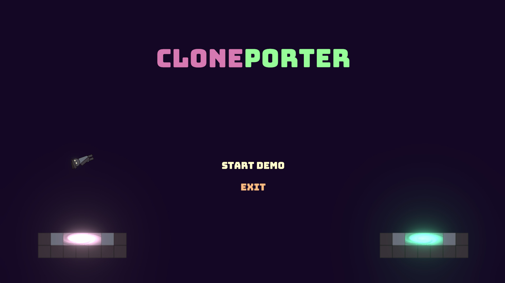
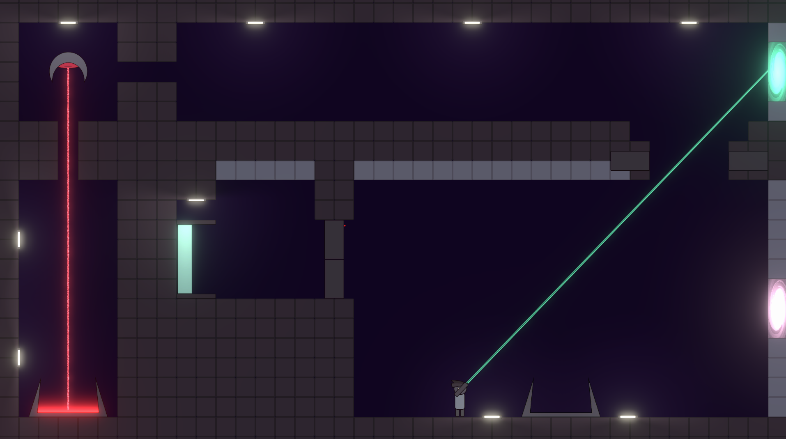

# Cloneporter

## 🎮 Play the Game
Play Cloneporter now on my [itch.io](https://sevlak.itch.io/cloneporter) page!

This is a 2D game based on the classic puzzle shooter Portal by Valve.

You can move around with WASD controls, use space to jump, and the mouse to aim and shoot portals.

Hold Left-click down to aim a purple portal, and hold Right-click down to aim a teal portal. When either button is released, the portal will be fired and placed onto a panel surface (white tile) as long as a valid position is found! You can't place them on anything other than white panel tiles.

Momentum is conserved between portals, so use this to your advantage to make it to the elevator and beat the level!

## 📸 Screenshots

## 🛠️ Controls
- **Arrow Keys / WASD** – Move
- **Spacebar** – Jump
- **Mouse Click** – Place and activate portals
- **Esc** – Pause Menu
