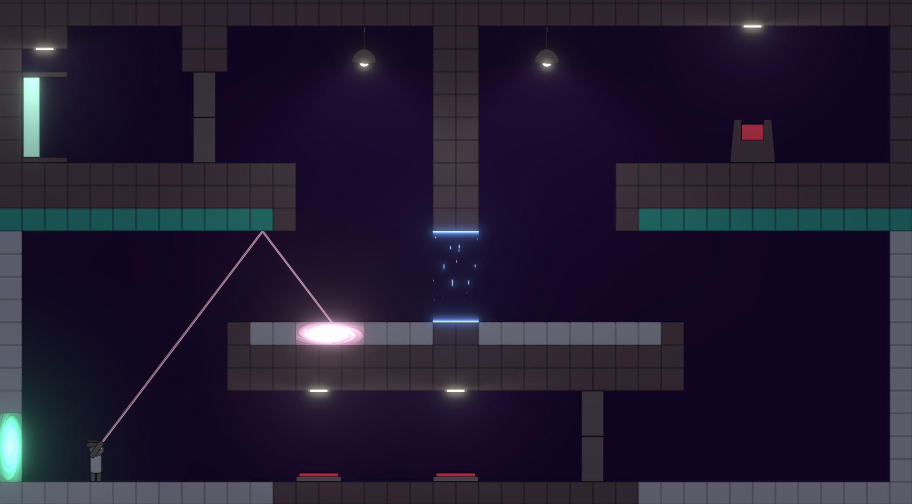

# Cloneporter

## 🎮 Play the Game
Play Cloneporter now on my [itch.io](https://sevlak.itch.io/cloneporter) page!

A 2D puzzle-platformer where you use teleportation and cloning mechanics to solve challenges and escape tricky levels. Inspired by classic puzzle games but with a unique twist!

## 📸 Screenshots

## 🛠️ Controls
- **Arrow Keys / WASD** – Move
- **Spacebar** – Jump
- **Mouse Click** – Place and activate portals
- **Esc** – Pause Menu
